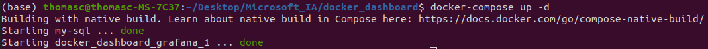
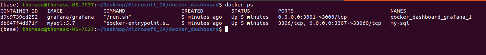
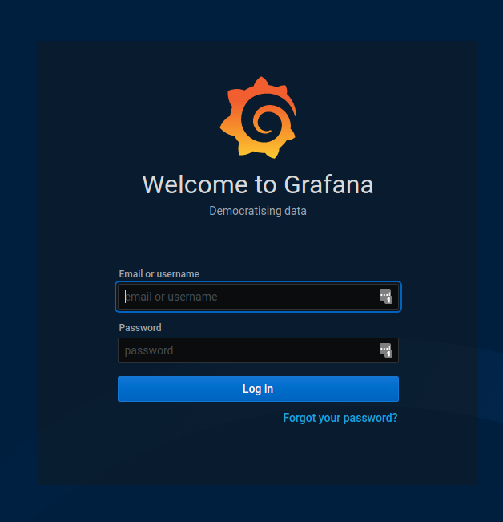
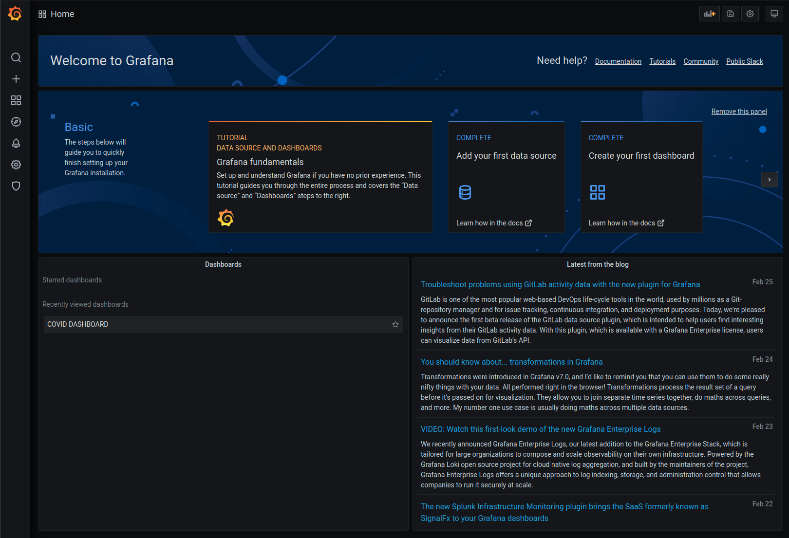
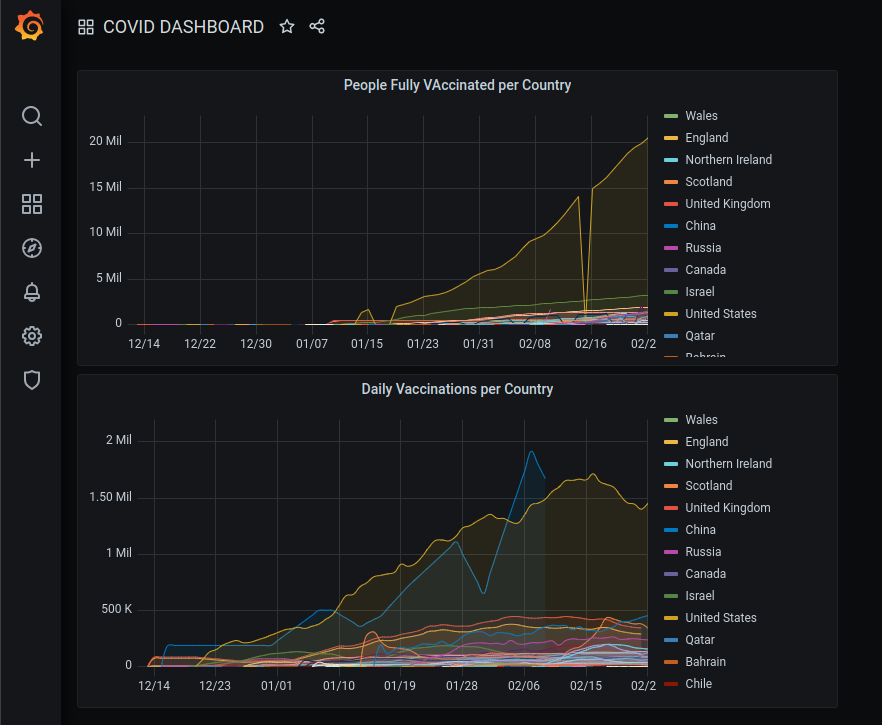

# Installation

Clone this repository to your local machine.

```bash
git clone https://github.com/ChainYo/docker_dashboard
```

You need to `cd` to the new cloned repository.

```bash
cd docker_dashboard
```

Check your `Docker` version with `docker --version`.   
I used this one: `Docker version 20.10.3, build 48d30b5`.

If you don't have `Docker` installed on your local machine, you can follow this [link](https://docs.docker.com/engine/install/) to get full installation steps (be sure to select your own os).

Then, you can start containers.

```bash
docker-compose up -d
```

You should see the following lines.



You can check the containers running with `docker ps`.



# Dashboard access

You can access to your dashboard with this link: http://localhost:3001

You will land on this grafana login portal.



- username = `admin`
- password = `admin`

Then, `Grafana` will ask you to choose a new password to connect to the dashboard. You are free to choose your own password for the next connection. You can also `skip` this part by clicking on skip.

You are now connected to your `Grafana portal`. There is one dashboard pre-loaded for you named `COVID DASHBOARD`.



You can click on it and you will access to 2 pre-loaded panels.



---

If this github repository helped you, you can star it by clicking on the `Star` button on the top right corner of this github page.

You can also `Fork` it, if you want to.

Finally feel free to PR if you want to add something usefull. Cheers :)